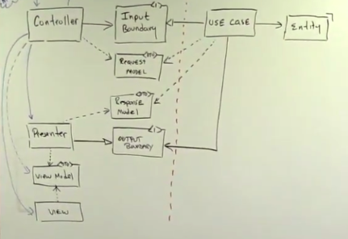

# Clean Architecture in Golang

  

## Clean Architecture Flow
* The Controller invokes the use case with a Request Model and a Presenter (Output boundary)
* The Use case generates the Response Model and hands it to the Presenter
* The Presenter generates the View Model
* The Controller grabs the View Model and passes it to the view
* The View generates the HTML
* The response model and view model are similar. The main difference is that the response model contains data types and the view model contains strings e.g. Respose model had dates and objects and response model has them as strings

